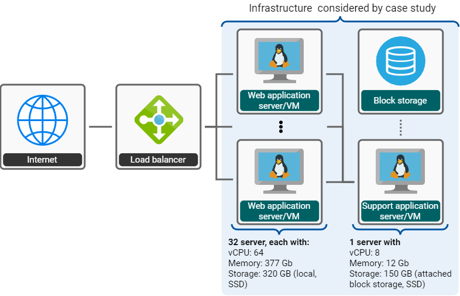

# Case Study

## About

### Brief summary

In this case study, we calculated the estimated costs for a hypothetical cloud migration of a compute infrastructure for an information system of an industry company. The information system was operated on compute infrastructure owned and operated by the company. The product owner responsible for this information system collaborated with us to find out what the infrastructure would cost if it were migrated to the Microsoft Azure cloud (choice of cloud was given).

### Goals of this case study

This is a first case study for the CCCM in which we aimed to explore whether we can model real-world compute infrastructures and calculate the estimated cloud costs.

We did not focus on the cross-provider aspect here. The industry company that we cooperated with for this case study was interested in cost estimates for Microsoft Azure since this cloud provider was already chosen by the company at the time of the case study.

### This case study is based on prior work

This case study is based on a case study conducted in 2022 as part of a master thesis \[1\] at the Research Group Software Construction, RWTH Aachen University. The case study here deviates from the original case study such that
1. a revised cost calculation model is used (the Cross-provider Cloud Cost Model (CCCM)) that also support IOPS for block storage,
2. the cost calculations are done for an update time interval (February 2023), and
3. scenarios 3 and 4 are replaced by a revised scenario.

---

\[1\]: F. Friedberger; *A Provider-Independent IaaS Cloud Cost Estimation*; Master Thesis at Research Group Software Construction, RWTH Aachen University; 2022

### Anonymity of cooperating company

We do not disclose the names of the company and the studied information system. However, we describe what the system essentially does and the infrastructure it was deployed on.

### GB vs GiB

Throughout this case study we make no difference between GB vs GiB. This is not accurate. To improve this, one would need to study the Microsoft Azure's documentation and model the units in CCCM correspondingly, which can be done in the current version of the CCCM, but is incovenient. We work on improving unit handling.

## Subject of our study

### Software applications

The compute infrastructure serves the deployment of two applications:

The **information system application** responded to requests from the internet. This information system served its requests based on a dataset that was entirely kept in memory and updated frequently. The information system did not keep a state about requests, i.e., each request was processed independently from other requests. This enabled running multiple instances of the information system and distributing requests to these instances to scale with the number of requests.

A **support application** was responsible for communicating updates to the dataset to all information system instances.

### Compute infrastructure

Both applications were deployed to **infrastructure** operated and owned by the company:
- The information system was deployed to a cluster with 32 equally equipped dedicated servers. Each dedicated server was equipped with 64 vCPU, 377 Gb of memory, 320 GB of local SSD storage. The number of servers was chosen such that it can handle peak load situations, i.e., the servers were overprovisioned.
- The support application working in the background was deployed to one virtual machine equipped with 8 vCPU, 12 Gb memory, and 150 Gb of attached SSD block storage. 
- Requests to the information system were distributed in a round-robin approach by a load balancer. This load balancer is not considered by our case study since in the first version of the CCCM only servers and block storage can be modeled.

The infrastructure is illustrated by the following figure:

 

### Software architecture redesign & cloud migration

At the time of the case study, the team developing this infrastructure was exploring ideas for an architectural redesign. Multiple reasons were motivating the interest in a redesign, one of them being the high memory requirements, which is why the servers were equipped with 377 Gb. The reason for this need for memory was that the application kept large amounts of data for fast access in the memory. While the team had reasons for doing this, the application's ability to scale with respect to the size of the dataset was a challenge as installing more memory would come at increasing hardware costs and eventually be infeasible. Thus, the team explored options for an architecture enabling not only the distribution of the load but also of the dataset.

At about the same time the company was pushing for migrating more systems to the cloud. The information system's product owner was seeking a better understanding of the cost implications before making a decision about a cloud migration. For this, we discussed multiple scenarios with the product owner:

- Scenario 1: Migrate the existing information system's infrastructure to the cloud as it is. This scenario does not make use of the cloud's elasticity, i.e., flexibly provisioning and releasing servers to scale with requests and only paying for what is needed.
- Scenario 2: Migrate the existing information system's infrastructure to the cloud and enable scaling the number of servers, i.e., making use of elasticity. We analyzed time series data on the number of requests to identify how many servers we would need.
- Scenario 3: Assume the implementation of the discussed redesign of the information system that aims to scale more flexibly. For this scenario, we assume smaller VM types for the information system. Considering that smaller general purpose VMs have a lower price per vCPU, we want to investigate the savings potential.

Subsequently, we describe the scenarios' compute infrastructures and the corresponding estimated costs calculated with the CCCM.

## Case study scenarios

The case study considers three scenarios, which describe in this section:

- Scenario 1: migration of existing infrastructure (no elasticity)
- Scenario 2: migration of existing infrastructure (elasticity)
- Scenario 3: architecture redesign (elasticity + different VM instance types)

### Scenario 1: migration of existing infrastructure (no elasticity)

In this scenario, the above-presented infrastructure is migrated one to one to Microsoft Azure using manually selected best-fitting offers for VMs and storage. Here, the **infrastructure is modeled to be static**, i.e., we do not consider scaling the number of virtual machines and accept over provisioning - the same as we do with the existing infrastructure owned and operated by the company.

No.| Count | Name                          | Offer
---|-------|-------------------------------|-------------------
1  | 32    | `information_system_server`   | Virtual machine: Standard E64is v3 (64 vCPU, 432 GiB memory), Azure region: North Germany
2  | 1     | `support_application_server`  | Virtual machine: Standard F8s v2 (8 vCPU, 16 GiB memory, 64 GiB temporary storage), Azure region: North Germany
3  | 1     | `support_application_storage` | Block storage: Standard SSD, E15 (256 GiB), Local Redundant Storage (LRS), Azure region: North Germany

### Assumptions

- We assume the information system and support application perform equally on a cloud virtual machine instance with approximately same amount of vCPU, memory, and storage.
- For the storage we assume that the SSDs in the cloud provide equal performance.
-  We further assume that the closest matching virtual machine type in the Azure region Germany North, which is *E64is v2* (by the time of the original case study), provides about the same information system application performance. Note the difference of 8 vCPU that may affect the result in favor of the cloud migration.

### Scenario 2: migration of existing infrastructure (elasticity)

Similar to scenario 1, the infrastructure is migrated to Microsoft Azure using manually selected best-fitting offers for VMs and storage. Here, the **infrastructure is modeled to be dynamic**, i.e., we consider scaling the number of virtual machines to reduce over provisioning. For this we analyzed recorded load data for the information system servers. The load exhibits a repeating pattern for every day, from which we derived the following need for the number of information system servers per day:

Number of instances | Time window    | Description
-------------------:|----------------|----------------------------------------------
8                   | all day        | baseline number of instances used all day
3                   | 05:00 to 23:30 | additional instances in the given time window
5                   | 06:00 to 22:30 | additional instances in the given time window
4                   | 08:00 to 21:30 | additional instances in the given time window
1                   | 10:00 to 20:30 | additional instances in the given time window
3                   | 16:00 to 20:00 | additional instances in the given time window

Note that in the peak of this pattern only 24 servers are required, i.e., 8 servers less than the 32 owned servers. There are two reasons for this deviation:
1. This load in the month we considered for analyzing the load pattern was lower than usual and thus lower than the load the infrastructure was planned for (according to the product owner).
2. To cover usage peak situations, the infrastructure was designed to be over provisioned.

Thus, the company knowingly accepted that the load was lower than the capacity. However, since cloud providers enable using resources on-demand, we modeled this scenario to use only the servers needed (based on the table above):

No.| Count    | Name                          | Offer
---|---------:|-------------------------------|-------------------
1  | 8 to 24* | `information_system_server`   | Virtual machine: Standard E64is v3 (64 vCPU, 432 GiB memory), Azure region: North Germany
2  | 1        | `support_application_server`  | Virtual machine: Standard F8s v2 (8 vCPU, 16 GiB memory, 64 GiB temporary storage), Azure region: North Germany
3  | 1        | `support_application_storage` | Block storage: Standard SSD, E15 (256 GiB), Local Redundant Storage (LRS), Azure region: North Germany

\* varying over time according to schedule presented in the previous table

#### Assumptions

- We assume that we can provision the required virtual machines on-demand at any time. This is not always true and some cloud providers - including Microsoft Azure - allow to reserve capacity in exchange for a payment. We did not consider such a payment in this case study. This influence the estimate to be lower than what would be accurate.

### Scenario 3: architecure redesign (elasticity + different VM instance types)

In this scenario, we assume the implementation of a redesign of the information system that enables an much more distributed operation. Here, we use the VM instance type *Standard D8as v5* for the information system servers. This instance type is smalled than the *Standard E64is v3* used in scenario 1 and 2. We use a larger number of servers to compensate for the lower number of vCPU and memory. Further, we must add block storage to the scenario as the *Standard D8as v5* does not come with its own storage.

No.| Count     | Name                          | Offer
---|----------:|-------------------------------|-------------------
1  | 72 to 216*| `information_system_server`   | Virtual machine: Standard D8as v5 (8 vCPU, 32 GB memory), Azure region: North Germany
2  | 72 to 216*| `information_system_storage`  | Block storage: Standard SSD, E10 (128 GiB), Local Redundant Storage (LRS), Azure region: North Germany
3  | 1         | `support_application_server`  | Virtual machine: Standard F8s v2 (8 vCPU, 16 GiB memory, 64 GiB temporary storage), Azure region: North Germany
4  | 1         | `support_application_storage` | Block storage: Standard SSD, E15 (256 GiB), Local Redundant Storage (LRS), Azure region: North Germany

\* Varying over time according to schedule presented in the previous table times a factor of 9. A  reason for this factor is given in the assumptions blow.

#### Assumptions

- We assume the information system redesign enables even distribution of load across all instances. This is probably not accurate.
- We assume the information system redesign leads only to a small distribution management overhead for the overall application's performance. To provide the required information system application performance, we assume to need the same total number of vCPU as in the previous scenarios plus 1 additional VM per 8 information system VMs for load distribution overhead. 
- We further assume that we always need sufficient VMs such that the total memory can cover the information system's dataset. We assume here that there is no memory overhead introduced by the increased distribution. Thus, at any time we need to have sufficently many "Standard D8as v5" VMs to have 370 GB memory at any time. Note that this assumption does not have an effect as the number of VMs required by the previous assumption is larger.
- We assume the same load pattern per day as in scenario 2. The smaller VM type in this scenario would allow a more fine granular scaling pattern. We do not make use of this and thus loose potential for lowering the costs.

## Results: estimated cloud costs

The table below shows for each scenario for the time interval of February 2023 what the total costs would have been if we implemented the infrastructure accordingly. We assumed that the prices we retrieved on March 19th 2023 from Microsoft Azure's documentation and the [Azure Price Calculator][1] apply for this interval.

Scenario   | Modeled resources | Cost (CCCM)    | Cost ([Azure Price Calculator][1]) | Deviation (abs.)
-----------|------------------:|---------------:|-----------------------:|---------------------:
Scenario 1 |                34 | USD 122,779.74 |        USD  122,779.74 | 0.00
Scenario 2 |               458 | USD  65,175.44 |      * USD   65,175.43 | 0.01
Scenario 3 |             8,210 | USD  58,459.41 |      * USD   58,459.40 | 0.01

\* To calculate the costs with the [Azure Price Calculator][1], we needed to perform manual intermediate step calculations. The reasons for this are:
- The price calculator does not enable defining scaling behavior for virtual machines and storage. Instead we can compute the resulting usage for VMs and storage, i.e., the total instance time (instance hours), the total storage size (GB * hours), and the total storage IOPS (Azure IOPS units); then we can enter these in the calculator.
- The price calculator calculates with average months (=730 hours) whereas the CCCM calculates with the precise length of the month (e.g., for the time interval we considered here: February 2028 = 28 days = 672 hours). This is relevant when prices are given as hourly prices, e.g., for virtual machines.
- The price calculator expects the user to provide the IOPS in terms of the Azure IOPS unit (10,000 IOPS) and the calculator does not consider the applicable max. hourly and max. monthly costs for IOPS.

These intermediate steps are not required when using the CCCM to calculate the costs. Thus, this is an **advantage of the CCCM over the price calculator**.

### Detailed output

The detailed output of the CCCM prototype can be found here
- [Scenario 1](./result_scenario1.md)
- [Scenario 2](./result_scenario2.md)
- [Scenario 3](./result_scenario3.md)

### Notes
- The **number of modeled resources** is determined as follows
  - For scenario 1, we have in total 34 resources:
    - 32 are information system servers
    - 1 server plus 1 block storage for the support application
  - For scenario 2, we have in total 458 resources:
    - 456 are information system servers with
      - 8 baseline servers
      - 448 dynamically added servers due to the scaling behavior:
       $\left(3+5+4+1+3\right) \text{instances/day} \cdot 28 \text{days in February 2023} = 4,032$
    - 1 server plus 1 block storage for the support application
  - For scenario 3, we have in total 8,210 resources:
    - 8,208 are for the information system servers and required block storage (the VM instance type in this scenario does not come with storage and thus requires extra block storage) with
      - 72 baseline servers: 
        $9\cdot8 = 72$
      - 4,032 dynamically added servers due to the scaling behavior: 
        $9 \cdot \left(3+5+4+1+3\right) \text{instances/day} \cdot 28 \text{days in February 2023} = 4,032$
      - 72 baseline servers' storage
      - 4,032 dynamically added servers' storage
    - 1 server plus 1 block storage for the support application
- **Deviation**: For scenarios 2 and 3, the difference of 0.01 USD in the calculated costs is likely caused by different rounding and/or precision implementations in the calculations of the CCCM and the [Azure Price Calculator][1].

[1]: https://azure.microsoft.com/en-us/pricing/calculator/